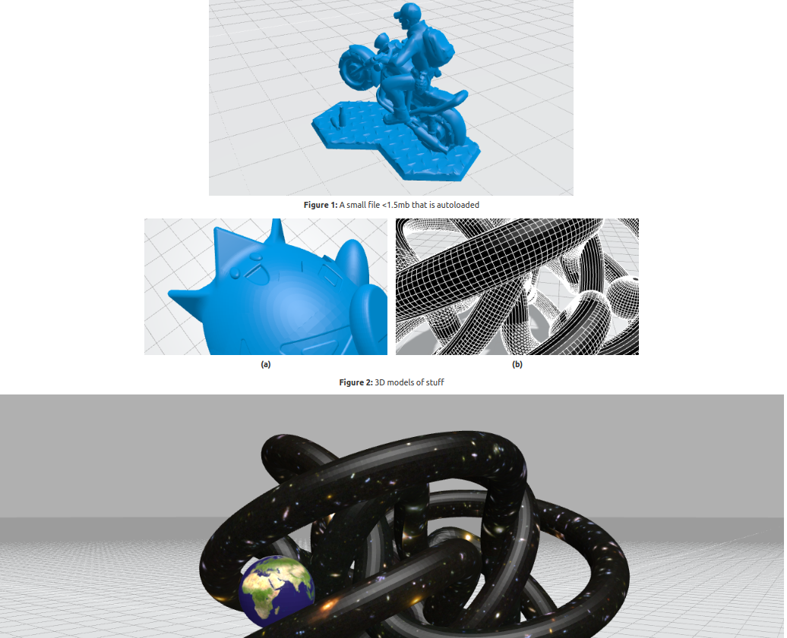

# threejs plugin for DokuWiki

Syntax for embedding threejs components.

## Features

 - Supports formats STL, 3MF, VRML and simple to add more. 
 - Flags to set model colour and wireframe etc
 - Auto-load scene if file size is small (default = 0.5mb), except when on a mobile device.
 - Auto-fit model to view on load, and adjust lighting and shadowing accordingly. 
 - Integrated with dokuwiki move plugin to re-write links.
 - Works with other plugins such as latexcaption

## Syntax
Syntax is identical to dokuwiki media.
 - Spaces either side of the curly braces represent alignment
 - Flags to set canvas width/height and other model specific settings (colour etc).
 
|Flag|Description  | Default
|--|--|--|
| ..x.. | Width and height in px. If only one value it is assumed width, and height is calculated to maintain 16:9 aspect ratio.  | 100% width, 600px |
| wireframe | Display mesh wireframe | Disabled | 
| color | W3C color name or hex value | #00398a |
| nofloor | Removes the floor and grid in scene | Disabled |
| linkonly | Don't render canvas, only link to download | Disabled |
| noautoload | Don't auto load the canvas even if filesize less than threshold | Disabled |

### Examples:
A centered canvas with default size (100% width, 600px height), with the title "Some model".

     {{ .path_to_model.3mf|Some model }}

Right aligned with canvas size 600x400px, wireframe on, and set model colour green.

     {{ .path_to_model.3mf?600x400&wireframe&color=green}}

## Aditional Info

If you install this plugin manually, make sure it is installed in
lib/plugins/threejs/ - if the folder is called different it
will not work!

Please refer to http://www.dokuwiki.org/extensions for additional info
on how to install extensions in DokuWiki.

----
Copyright (C) Ben van Magill <ben.vanmagill16@gmail.com>

This program is free software; you can redistribute it and/or modify
it under the terms of the GNU General Public License as published by
the Free Software Foundation; version 2 of the License

This program is distributed in the hope that it will be useful,
but WITHOUT ANY WARRANTY; without even the implied warranty of
MERCHANTABILITY or FITNESS FOR A PARTICULAR PURPOSE.  See the
GNU General Public License for more details.

See the LICENSING file for details
